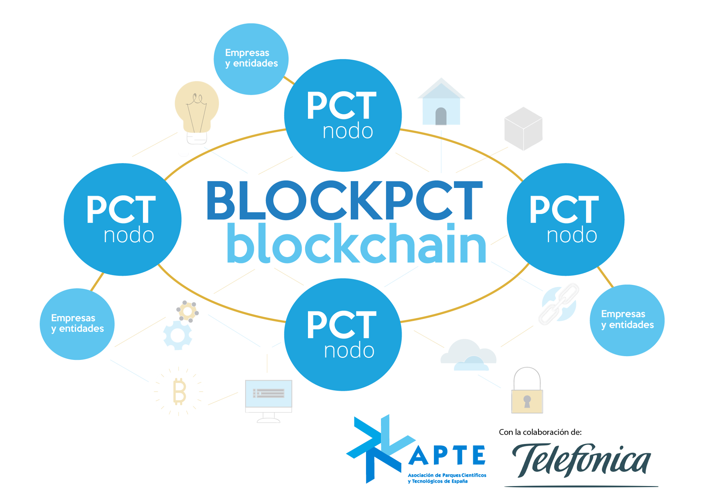

# Red privada e independiente de blockchain de los parques científicos y tecnológicos españoles: BLOCKPCT

Why worrying about the low-level complexities of blockchain technology,
and having to worry about building your network when you can leverage
the benefits of the technology without having to know the details of
its operation? Our TrustOS abstracts all the complexity of blockchain
technology implementing the basic operations you need to leverage
the power of blockchain technology. 

In this repository you will find a set of simple examples for developers who wish to develop blockchain solutions without having to dig deep into the low-level through Telefonica's TrustOS.

We have created several APIs for tracking the whole lifecycle of assets, for creating and managing transferable tokens, for offering agreement between diferent parts and ensuring confidence and integrity in the all the generated information.

**Table of Contents** 
- [Track API](./docs/apis.md#track-api)
- [Token API](./docs/apis.md#token-api)
- [Settlement API](./docs/apis.md#settlement-api)
- [ID API](./docs/apis.md#id-api)

You can find the documentation of these APIs in the [docs folder](./docs/apis.md), and a set of guided examples in the [tutorial folder](./tutorials).

From this [URL](https://blockchainactivation.wayra.co/trustos) you can access every API from our TrustOS.

Happy coding!

