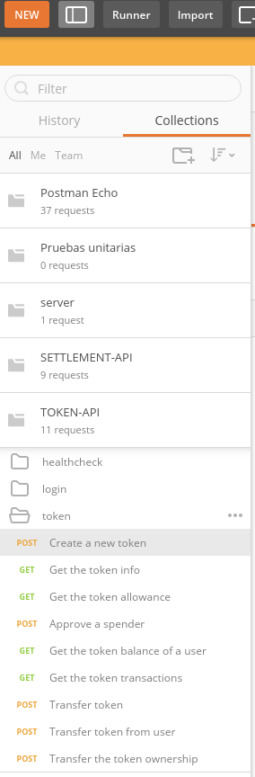
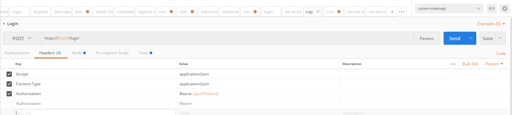
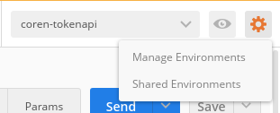
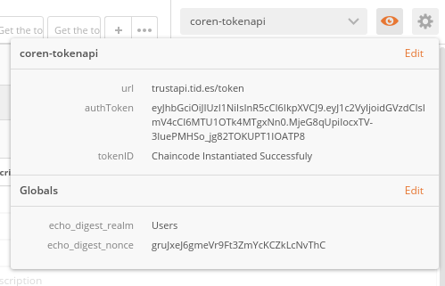
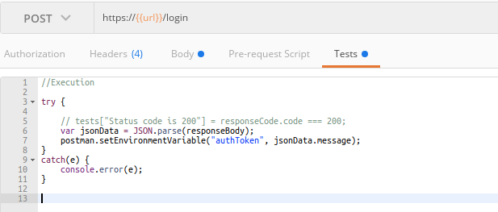
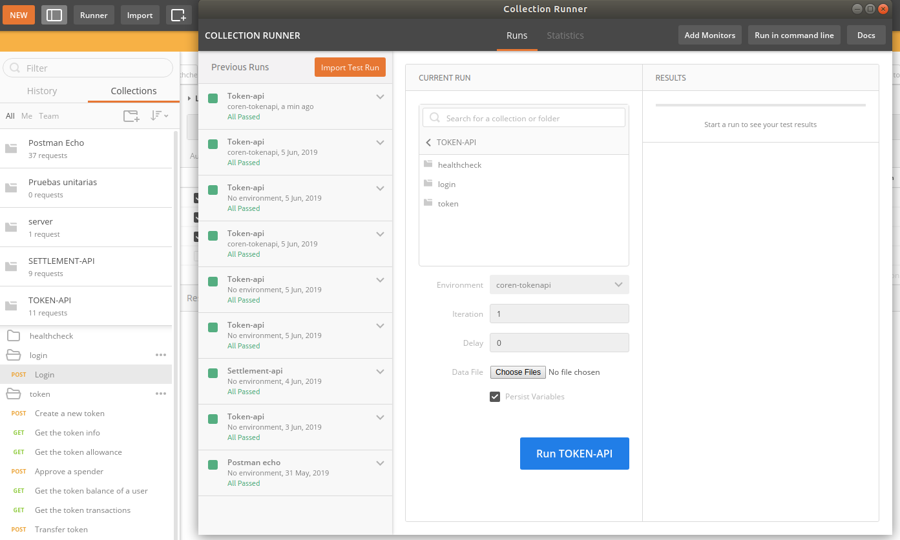

## Postman collections

Postman is a fantastic software that lets us run requests against our APIs. 

One of the many great tools of Postman are collections, sets of grouped requests that can be exported/imported, in order to be ran alltogether for testing purposes.

### Import collection

1. First, download the collections we have created on the folder **miscelanea/postman**

   You will see 2 diferent files: **collections** and **enviroment**.  

   Download both, as we will explain later what are enviroments for.

2. On Postman, click on "Import" , and then select **Import file**. 

   After doing so, on the left pannel you should see the collection you just imported, as shown in the image

    

3. Now that we can see the collection, lets take a  
    look at the URL for which the request is being made:

     

    We can see that the URL contains: " {{url}} "

    This is a variable in POSTMAN. The nice things about using variables, is that we can change the endpoints of the APIs without having to modify the requests, but only the **enviroment** file, where the enviroment variables are specified. 

    To load a specific enviroment file, click the configuration button, manage enviroment, and select the enviroment file you want to load. 

     

    Great! Now, by clicking on the eye, you can watch the **actual values** of the enviroment values

    

    #### Side note ####
    Why do we say "actual values"? Becouse values can change dinamically

    We can see that under the URL field there are some others others. 

    Concretely, **pre-reqest scripts** are scripts that execute right before the query is made, where **tests** are scripts that execute after the request is made.

    

    Luckily you dont have to worry about this, since we have already taken care of it.
    When you execute the login request, the Auth token received is set as the value of the variable "AuthToken", which is later used in the **Header** tab (as can be seen in the second image of this tutorial)

4. Finally, now that we have everything set up, click on the "Runner" tab on the top left of the screen. Select the collection you want to run, the enviroment file you want to use for this collection, and run the tests! 

 